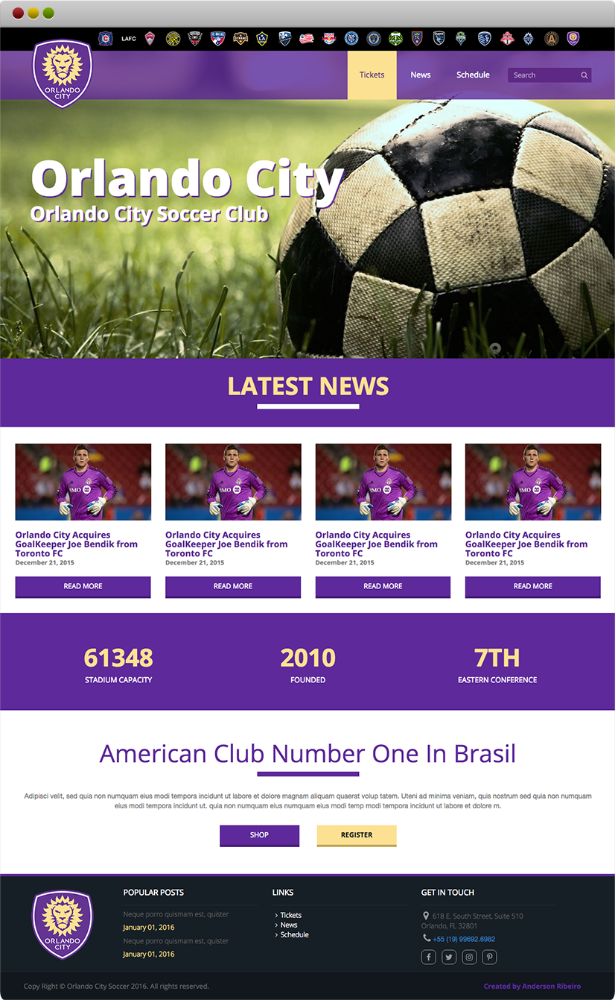

# Website Orlando City

Este foi o meu segundo projeto de desenvolvimento web com HTML 5, CSS3, JavaScript e responsividade, desenvolvido em conjunto do curso Curso Completo do Desenvolvedor Web da HCODE: https://hcode.com.br.

Link do projeto: https://orlandocity.andribeiro.dev
